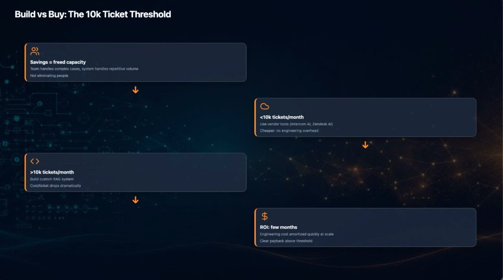
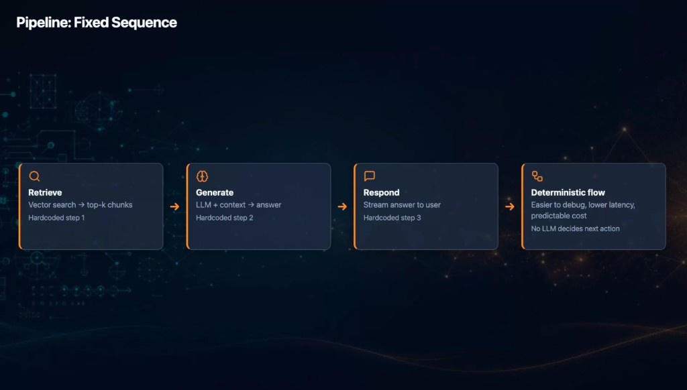
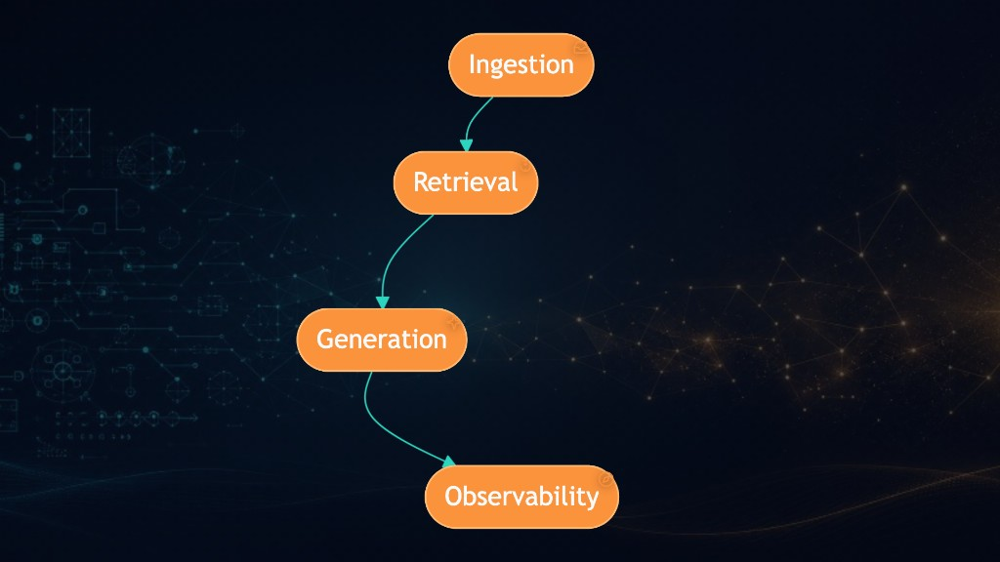
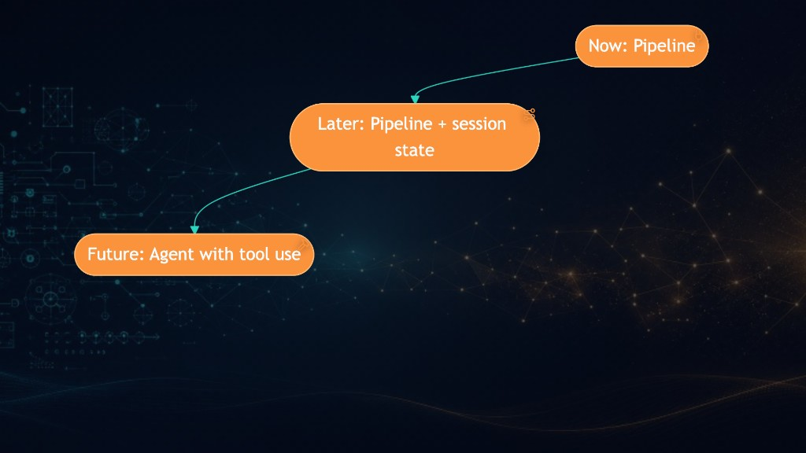
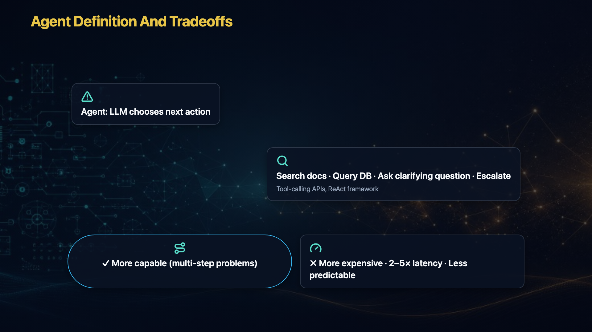
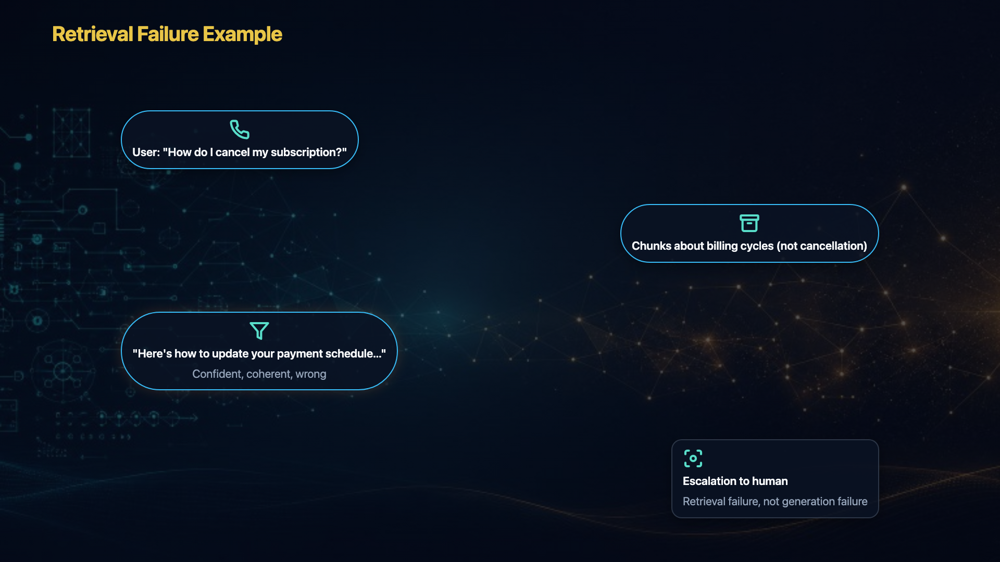
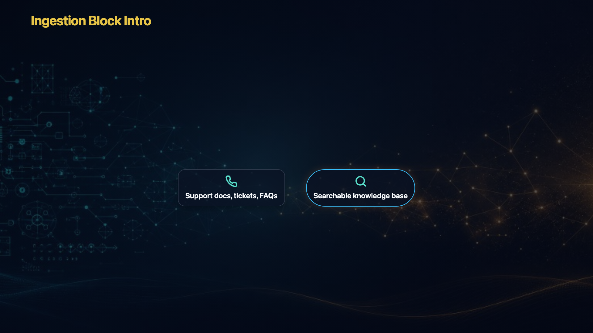

# Production Fix Plan — Step-by-Step Bug Log

**Status:** Имплементация — **Шаг 2 done** (Mermaid layout); далее шаг 3 Motion  
**Last updated:** 2026-07-14  
**Episode:** `ep01-cycle-1-rag-support-knowledge-assistant`  
**Workflow:** пользователь передаёт баги по одному → фиксируем здесь → после полного списка начинаем исправления

**Справка по архитектуре:** motion / excalidraw / diagrams — в основном автономные рендереры; общий слой: `frame-qa.ts`, `icons/`, `themes/`. См. также `docs/FRAME_QA_RESEARCH.md`.

---

## BUG-M01 — Motion `reading-zigzag`: стрелки в пустоту, мелкий текст, пустые блоки

| Поле | Значение |
|------|----------|
| **Файл** | `assets/motion/scene-002-b.mp4` |
| **Scene ID** | `scene-002-b` |
| **Renderer** | `motion` |
| **Шаблон в плане** | `zigzag-flow` → код: **`reading-zigzag`** (`motion/templates.ts` → `buildReadingZigzagHtml`) |
| **Заголовок сцены** | Build vs Buy: The 10k Ticket Threshold |
| **Шагов** | 4 |



### Симптомы

1. **Стрелки** — идут строго **вниз по центру** между шахматными блоками, указывают в **пустое пространство**, а не на следующий блок. Визуально непонятно, куда ведёт flow.
2. **Reveal** — блоки появляются отдельно от стрелок; стрелка не «ползёт» к следующему блоку, второй блок не появляется в момент прихода стрелки.
3. **Типографика** — шрифты в блоках **слишком мелкие** относительно кадра 1920×1080; текст трудно читать.
4. **Layout блока** — иконка сверху, заголовок и текст столбиком слева; **~60–70% ширины блока пустое**; ничего не отцентрировано.
5. **Заполнение кадра** — много пустого места на фоне; блоки малы; контент не использует доступное пространство (~70% fill не достигается).

### Ожидание (от пользователя)

**Стрелки — L-образный путь (угол, не диагональ):**
- Блок 1 → стрелка **вниз + влево** к блоку 2  
- Блок 2 → стрелка **вниз + вправо** к блоку 3  
- Блок 3 → стрелка **вниз + вправо** к блоку 4  

**Reveal — connector-draw:**
1. Появляется блок N  
2. От него **анимированно ползёт** стрелка (draw-on) по L-пути  
3. В момент прихода стрелки к началу блока N+1 — появляется блок N+1  

**Layout блока:**
- Иконка и название **в один ряд** (минимум)  
- Крупнее шрифты (заголовок + body)  
- Блоки крупнее; лучше центрирование внутри карточки  
- Лучше заполнение кадра при 4 шагах zigzag  

### Файлы для фикса (когда начнём работу)

```
packages/production-engine/src/motion/templates.ts   — buildReadingZigzagHtml, arrow direction, block layout
packages/production-engine/src/motion/html.ts        — стили .zig-item, .pipe-node
packages/production-engine/src/motion/render.ts      — frame-qa profile motion (fill)
```

### Не в scope этого бага

- Другие motion-шаблоны (`pipeline-horizontal`, `split-track`, …)  
- Excalidraw / diagrams  

---

## RULE-G01 — Внутренний layout блока + семантика иконок (все рендереры, **кроме ui-cards**)

**Исключение:** `ui-cards` — не трогаем, эталон готов.

**Применяется к:** motion (все шаблоны с блоками), excalidraw, mermaid (иконки у нод).  
**Эталон для вдохновения (не менять):** `ui-cards` — `.card-head` (иконка + заголовок в ряд).

### Правило layout внутри блока

| Сейчас (плохо) | Ожидание |
|----------------|----------|
| Иконка сверху, заголовок ниже, body ещё ниже | **Иконка + заголовок в одной строке** |
| Мелкий шрифт, пустота внизу блока | Крупнее заголовок (белый) и серый body; **без увеличения внешнего размера блока** — перераспределить элементы внутри |
| Всё прижато к левому верхнему углу | Иконка в начале строки; заголовок **центрирован** в блоке (с отступом от иконки); body ниже, крупнее, читаемее |

Порядок reveal не меняется: иконка и заголовок появляются **вместе** с блоком.

### Правило семантики иконок

Иконка должна соответствовать **смыслу** шага (label + visual + annotation), а не случайному хешу. Проверять каждую сцену; при несоответствии — `explicit` icon в плане или улучшить `resolveIconName` seed/heuristics.

**Файлы (когда начнём):**
```
packages/production-engine/src/motion/templates.ts     — pipelineNodeHtml, .pipe-head
packages/production-engine/src/excalidraw/html.ts    — renderSketchBox, .sketch-box-head
packages/production-engine/src/mermaid/reveal.ts       — injectMermaidNodeIcons
packages/production-engine/src/icons/index.ts        — resolveIconName, catalog
```

---

## BUG-M02 — Motion `pipeline-horizontal`: layout блока + иконки (scene-004-a)

| Поле | Значение |
|------|----------|
| **Файл** | `assets/motion/scene-004-a.mp4` |
| **Scene ID** | `scene-004-a` |
| **Renderer** | `motion` |
| **Шаблон** | **`pipeline-horizontal`** (`buildPipelineHorizontalHtml` → `pipelineNodeHtml`) |
| **Заголовок** | Pipeline: Fixed Sequence |
| **Шагов** | 4 (Retrieve → Generate → Respond → Deterministic flow) |
| **Связь** | Экземпляр **RULE-G01** для motion pipeline |



### Симптомы

1. **Layout** — иконка отдельной строкой над заголовком; заголовок и серый текст столбиком слева; **много пустого места внизу** каждого блока при маленьком шрифте.
2. **Типографика** — label и annotation/visual слишком мелкие для 1920×1080; пространство внутри блока не используется.
3. **Центрирование** — заголовок не центрирован в карточке; визуально «прилипает» к левому верхнему углу.
4. **Иконки по смыслу** (план → факт на скрине):
   - **Retrieve** — в плане `icon: "search"` (лупа); для RAG-retrieve / vector search **смысл слабый** (лупа = поиск, не «достать чанки»)
   - **Generate** — brain: сомнительно
   - **Respond** — ok (speech bubble)
   - **Deterministic flow** — abstract nodes: допустимо, но слабо

### Ожидание (от пользователя)

**Строка заголовка:** `[иконка] · [название]` — иконка в начале, небольшой gap, название **по центру блока**, белый, чуть крупнее.

**Body:** серый visual + annotation — **крупнее**, выше (поднять), заполнить пустоту внизу без изменения внешнего bbox блока.

**Иконки:** пройти все шаги сцены; подобрать семантически верные (или поправить explicit в плане / resolver).

**Анимация / стрелки:** в этой сцене **ок** (горизонтальный flow, стрелки →) — фиксим только interior layout + icons.

### Файлы для фикса

```
packages/production-engine/src/motion/templates.ts   — pipelineNodeHtml, pipelineLayoutCss (.pipe-head)
packages/production-engine/src/icons/index.ts        — semantic mapping для retrieve/generate/…
```

### Не в scope

- ui-cards  
- Размер блоков / fill кадра целиком (отдельно: scene-001-b и подобные horizontal 4-up)  

---

## RULE-D01 — Mermaid: композиция 16:9, иконки, shapes, motion (все diagram-сцены)

**Renderer:** `mermaid` → `assets/diagrams/`  
**Связь с RULE-G01:** иконки у нод — контрастный badge, не сливаться с fill ноды.

### Приоритет фиксов (P0 → P2)

| P | Что |
|---|-----|
| **P0** | Иконка: не на границе скругления, контрастная подложка (тёмный circle), fixed safe-zone % |
| **P0** | Flow **LTR** для read-LTR аудитории; единая ось / выравнивание узлов |
| **P1** | Заполнить 16:9: zigzag/serpentine/S-curve, не узкая вертикальная полоса |
| **P1** | Генеративный декор-слой (сетка/рельсы/частицы) под диаграммой |
| **P2** | Shape library по типу этапа (pill / hex / diamond / circle) |
| **P2** | Иерархия размера (ключевой узел крупнее) |
| **P2** | Micro-motion: ease-out scale, dash-offset на edge, glow на active node, slow zoom |

### Layout-паттерны (алгоритмизируемые)

- **Zigzag / serpentine** — узлы чередуют L/R вдоль центральной направляющей (таймлайн), порядок сверху вниз сохраняется  
- **Диагональная лестница** — смещение вправо-вниз (или влево-вниз) с «рельсами»  
- **S-curve horizontal** — для 3–4 узлов: слева направо с изгибом  

### Файлы (когда начнём)

```
packages/production-engine/src/mermaid/render.ts    — layout router, HTML layers, scale
packages/production-engine/src/mermaid/reveal.ts    — injectMermaidNodeIcons, edge draw-on
packages/production-engine/src/mermaid/fit.ts       — bbox, tier, fill 70%
packages/production-engine/src/themes/palettes.ts   — sanitize LR→TD, enhanceMermaidShapes
```

---

## BUG-D01 — Mermaid: узкая вертикальная полоса, примитивный вид (scene-003-a)

| Поле | Значение |
|------|----------|
| **Файл** | `assets/diagrams/scene-003-a.mp4` |
| **Scene ID** | `scene-003-a` |
| **Renderer** | `mermaid` |
| **Источник в плане** | `graph LR` → после `sanitizeMermaidSource` → **`graph TD`** |
| **Узлы** | Ingestion → Retrieval → Generation → Observability (+ feedback edges) |
| **Hold** | ~12s (мало контента — нужен micro-motion) |



### Что работает ✓

- Порядок reveal и логика стрелок (Ingestion → … → Observability)  
- Background (бренд + circuit/plexus)  

### Симптомы

1. **Композиция** — вся диаграмма в **узкой вертикальной полосе** по центру; слева/справа пустота при богатом фоне → «список в столбик», не инфографика 16:9.  
2. **Один shape** — все узлы одинаковые pill; нет иерархии (Generation как «сердце» не выделено).  
3. **Плоскость** — только капсулы + линии; нет декоративных слоёв (сетка, рельсы, glow).  
4. **Иконки (баг рендера)** — маленькая иконка в правом верхнем углу ноды: **на границе скругления**, залита **тем же оранжевым** → **не видна**. См. RULE-D01 P0, RULE-G01.  
5. **Анимация** — простой fade «элемент появился»; нет easing, draw-on edge, parallax, camera micro-move.

### Ожидание

- Layout: **zigzag/serpentine** или S-curve — занять горизонталь 16:9  
- Иконки: контрастный badge внутри safe-zone  
- Shapes: хотя бы 2–3 типа по смыслу этапа; Generation — акцент (крупнее/ярче)  
- Motion (~12s): overshoot scale, dash-offset на стрелках, glow active node, лёгкий zoom 105%→100%  

### Не в scope этой сцены

- Перегенерация visual-plan (source в плане можно оставить; layout выбирает рендер)  

---

## BUG-D02 — Mermaid: RTL flow, сбой оси, иконки (scene-004-d)

| Поле | Значение |
|------|----------|
| **Файл** | `assets/diagrams/scene-004-d.mp4` |
| **Scene ID** | `scene-004-d` |
| **Renderer** | `mermaid` |
| **Источник в плане** | `graph TD` — Now → Later → Future |
| **Узлы** | 3 (Now: Pipeline / Later: Pipeline + session state / Future: Agent with tool use) |



### Симптомы

1. **Ось / старт** — первый блок (**Now**) **прижат к правому краю**, не на общей оси с двумя другими → непонятно, с чего начинать чтение.  
2. **Направление flow** — визуально **справа налево**; для LTR-аудитории **противоестественно** (ожидание: слева → направо).  
3. **Композиция** — та же узкая диагональ/вертикаль; не использует ширину кадра.  
4. **Иконки** — тот же баг: на границе pill, **сливаются с оранжевым**, не видны.  
5. **Одинаковый размер** всех трёх узлов — нет иерархии «Future» как цель roadmap.  
6. **Анимация** — только появление; при 3 узлах и ~40s hold нужны паузы + lingering glow на уже показанных нодах.

### Ожидание (минимум P0)

1. Все 3 блока на **единой оси** / предсказуемой сетке  
2. Поток **слева направо** (Now слева → Later → Future справа), или явный timeline L→R  
3. Иконки: RULE-D01 P0 (badge + safe-zone)  
4. Декор-слой под диаграммой (сетка/частицы) — убрать «пустоту»  

### Ожидание (улучшения P1–P2)

- Горизонтальный ряд или S-curve для 3 узлов  
- Future-узел — визуальный акцент (shape/size)  
- Micro-motion: dash particle по edge, pulse glow между шагами  

---

## RULE-E01 — Excalidraw: sketch-стиль + layout engine (все excalidraw-сцены)

**Renderer:** `excalidraw` → `assets/excalidraw/`  
**Корневая проблема:** сейчас рендер — CSS-карточки (`.sketch-box`: скругления, glow, гротеск), визуально **неотличимы от motion/diagrams**. Пока не заведён настоящий excalidraw-look, любой «excalidraw»-режим будет выглядеть как обычная инфографика.

**Связь с RULE-G01:** иконка + заголовок в одну строку; для excalidraw дополнительно — правила 11–12 ниже (все с иконкой или ни у кого; фиксированная позиция слева от заголовка).

### Приоритет фиксов (P0 → P2)

| P | Что |
|---|-----|
| **P0** | **Настоящий excalidraw-look:** rough.js sketch stroke, handwriting font, плоская/прозрачная заливка, **без neon-glow/drop-shadow** |
| **P1** | **Сетка** (12 col × N rows), позиции по сетке, не хаотичные координаты |
| **P1** | **Обязательные hand-drawn коннекторы** между смыслово связанными блоками (причина→следствие, шаг→шаг) |
| **P1** | Порядок reveal = порядок чтения (сверху-вниз или слева-направо), без диагональных прыжков без маршрута |
| **P2** | Плотность кадра: &lt;3 элементов → крупнее блоки + сопроводительная скетч-графика |
| **P2** | Safe margin **8–10%** от краёв кадра |
| **P2** | Единообразие shapes в одном кадре (не pill+glow у одного, rect у других) |

### Визуальный язык (зашить в шаблон)

1. **Обводка** — rough.js `roughness` ~1–2, лёгкий jitter, углы не идеально геометричные  
2. **Шрифт** — Excalifont / Virgil (или аналог handwriting) для всех лейблов  
3. **Заливка** — прозрачная (только stroke) или плоский пастельный цвет, низкая насыщенность  
4. **Без glow/shadow** — убрать `.sketch-box-hero` box-shadow, neon border  
5. **Stroke** — фиксированная тонкая **1.5–2px**, одинаковая для всех блоков в кадре  
6. **Стрелки** — hand-drawn arrow с sketch-наконечником между связанными элементами  

### Layout engine (зашить в модель)

7. Сетка 12×N; позиция блока = cell, не произвольные %  
8. Reveal order совпадает с reading order (TD или LR)  
9. &gt;1 связанных элементов → **обязательная** стрелка/линия excalidraw-стиля (в плане `type: arrow` должен рендериться)  
10. Min/max плотность: мало элементов — scale up + декор (иконки, рамки, указатели), не пустой кадр  
11. Margin 8–10% — вся композиция внутри safe zone  

### Иконки (excalidraw-specific)

12. **Все с иконкой или ни у кого** — не смешивать в одном кадре  
13. Иконка **слева от заголовка на одной baseline**, fixed offset — не «плавает» сверху по-разному  

### Файлы (когда начнём)

```
packages/production-engine/src/excalidraw/html.ts     — renderSketchBox, CSS → rough.js SVG/canvas
packages/production-engine/src/excalidraw/layout.ts   — grid, density, margin, connector routing
packages/production-engine/src/excalidraw/render.ts     — frame-qa profile excalidraw
```

**Текущее состояние кода:** `html.ts` — div-based `.sketch-box` с `border-radius`, `box-shadow`, sans-serif; коннекторы из плана часто **не видны** на выходе.

---

## BUG-E01 — Excalidraw: не excalidraw-стиль, хаос layout, нет коннекторов (scene-004-b)

| Поле | Значение |
|------|----------|
| **Файл** | `assets/excalidraw/scene-004-b.mp4` |
| **Scene ID** | `scene-004-b` |
| **Renderer** | `excalidraw` |
| **Visual** | `agent_definition_and_tradeoffs` |
| **Заголовок** | Agent Definition And Tradeoffs |
| **Layout в плане** | `decision_tree` — 4 box + 3 arrow (цепочка + trade-offs) |
| **Hold** | ~38s |
| **Связь** | Экземпляр **RULE-E01** + layout/connectors |



### Симптомы

1. **Не Excalidraw** — тёмные карточки, скругления, glow-обводка, гладкие линии, гротеск → тот же «card»-компонент, что у diagrams/motion.  
2. **Layout хаотичный** — 4 карточки разбросаны без сетки (верх-слева, центр-справа, два внизу); нет единой оси.  
3. **Нет коннекторов** — между блоками **ни одной связующей линии**, хотя в плане arrows: Options → Trade-offs → плюс/минус. Логическая цепочка (определение → возможности → плюс → минус) не читается.  
4. **Несовместимость стилей в кадре** — «More capable» — **pill с синим glow**, остальные — прямые углы без обводки → элементы из разных наборов.  
5. **Иконки** — смешение: у части карточек есть, у части нет; позиция не единая (RULE-E01 п.12–13).

### Ожидание

- P0: rough.js sketch look, handwriting font, thin stroke, no glow  
- P1: grid layout; hand-drawn стрелки по плану `decision_tree`  
- Единый shape-language для всех 4 блоков  
- Reveal: сверху вниз по цепочке с draw-on стрелками  

---

## BUG-E02 — Excalidraw: зигзаг без маршрута, нет причинно-следственной цепочки (scene-003-f)

| Поле | Значение |
|------|----------|
| **Файл** | `assets/excalidraw/scene-003-f.mp4` |
| **Scene ID** | `scene-003-f` |
| **Renderer** | `excalidraw` |
| **Visual** | `retrieval_failure_example` |
| **Заголовок** | Retrieval Failure Example |
| **Layout в плане** | `flow_vertical` — 4 box + 3 arrow (вопрос → wrong chunks → wrong answer → escalation) |
| **Hold** | ~38s |
| **Связь** | **RULE-E01** |



### Симптомы

1. **Не Excalidraw** — тот же card-стиль, не sketch (см. RULE-E01 P0).  
2. **4 карточки без коннекторов** — в плане явные arrows между шагами; на экране **0 связующих линий**.  
3. **Порядок чтения сломан** — зигзаг по диагонали (верх-слева → центр-справа → центр-слева → низ-справа) без стрелок → 4 несвязанных факта, не история сбоя.  
4. **Смысл потерян** — должна читаться цепочка: вопрос → неверная выдача retrieval → неверный ответ → эскалация.  

### Ожидание

- P0: excalidraw sketch style  
- P1: вертикальный (или LTR) flow **со стрелками** строго по порядку reveal  
- Grid + единая направляющая; draw-on arrow между каждым шагом  
- Иконки: единое правило all-or-none + baseline left (RULE-E01)  

---

## BUG-E03 — Excalidraw: катастрофически пустой кадр (scene-003-b)

| Поле | Значение |
|------|----------|
| **Файл** | `assets/excalidraw/scene-003-b.mp4` |
| **Scene ID** | `scene-003-b` |
| **Renderer** | `excalidraw` |
| **Visual** | `ingestion_block_intro` |
| **Заголовок** | Ingestion Block Intro |
| **Layout в плане** | `pipeline_horizontal` — 2 box + arrow «Ingestion» (docs → KB) |
| **Hold** | ~16s |
| **Связь** | **RULE-E01** (плотность, margin) |



### Симптомы

1. **Не Excalidraw** — card-стиль вместо sketch (RULE-E01 P0).  
2. **Пустота** — 2 маленьких элемента в **нижней трети** кадра; ~70% — чёрный фон с едва заметным декором по краям.  
3. **Недогруженный слайд** — для 16s B-roll с заголовком выглядит как ошибка layout, не осознанный минимализм.  
4. **Коннектор** — в плане arrow «Ingestion» между box'ами; на скрине связь **не считывается** (отсутствует или не в excalidraw-стиле).  
5. **Margin** — элементы не в safe zone по центру; «прилипли» к низу.  

### Ожидание

- P0: sketch style + видимая hand-drawn стрелка между двумя блоками  
- P2: при 2 элементах — **увеличить масштаб** блоков, центрировать в safe zone (8–10% margin)  
- Добавить сопроводительную скетч-графику (иконки docs/KB, рамка flow) — заполнить кадр без лишнего смысла  
- Reveal: слева направо (docs → Ingestion arrow → KB)  

### Не в scope

- Переписывание narration / visual-plan (layout engine должен исправить из существующих `elements`)  

---

## Changelog

| Date | Change |
|------|--------|
| 2026-07-14 | Документ перезаписан: step-by-step bug log; добавлен BUG-M01 (scene-002-b) |
| 2026-07-14 | RULE-G01 (global block layout + icons, except ui-cards); BUG-M02 (scene-004-a) |
| 2026-07-14 | RULE-D01 (mermaid quality); BUG-D01 (scene-003-a); BUG-D02 (scene-004-d) |
| 2026-07-14 | RULE-E01 (excalidraw sketch + layout); BUG-E01 (004-b); BUG-E02 (003-f); BUG-E03 (003-b) |
| 2026-07-14 | **Шаг 1 done:** RULE-G01 — `iconBadgeHtml`, pipe-head/sketch-box-head, mermaid badge left of node; ep01 23/0 |
| 2026-07-14 | Косметика иконок: motion ×1.5, mermaid ×4 +10px left; `--renderer` + manifest merge |
| 2026-07-14 | **Шаг 2 done:** Mermaid LR layout, decor grid, icon 102px +33px gap; D01/D02 P0–P1 |
| 2026-07-14 | Mermaid icons: inline в label ноды (`labels.ts`), overlay удалён; `svg.flowchart` selector |
| 2026-07-14 | `iconBadgeSvg`: один SVG-слой (круг+глиф), solid bg, shadow на circle only |
